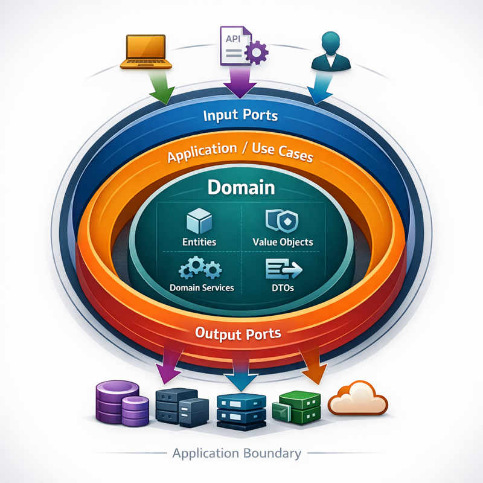

# go-simple-DDD
## A template on how to use the DDD approach (simplified version) when developing services on Go

## Architecture Overview

Clean Architecture + simple DDD (Domain First):



---

## Project Structure

```
go-simple-DDD/
├── cmd/                                        # entrypoints
│   └── server/                                 # main package of the service
│
├── internal/
│   ├── adapter/                                # input/output adapters
│   │   ├── controller/                         # http/grpc controllers
│   │   ├── repository/                         # output port implementations
│   │   │   └── postgres/                       # postgres repositories
│   │   └── system/                             # technical adapters: clock, uuid, etc.
│   │
│   ├── config/                                 # config loader + runtime configs
│   │   └── modules/                            # per-subsystem config modules (db, log, server, ...)
│   │
│   ├── domain/                                 # domain core
│   │   ├── entity/                             # entities and aggregates
│   │   ├── value/                              # value objects
│   │   ├── service/                            # domain services / policies / factories
│   │   └── dto/                                # domain DTOs
│   │
│   ├── infrastructure/                         # frameworks & drivers
│   │   ├── app/                                # bootstrap / DI / lifecycle
│   │   ├── http/                               # http server
│   │   ├── postgres/                           # db connection / pooling
│   │   └── middleware/                         # middleware (http, etc.)
│   │
│   ├── ports/                                  # input and output contracts
│   │   ├── input/                              # usecase interfaces
│   │   └── output/                             # repository/service interfaces
│   │
│   └── usecase/                                # application use cases
│       └── common/                             # shared application helpers
│
├── migrations/                                 # goose migrations
├── config/                                     # runtime yaml config
├── docker-compose.yml
├── Dockerfile
├── Makefile
├── go.mod
└── README.md
```
